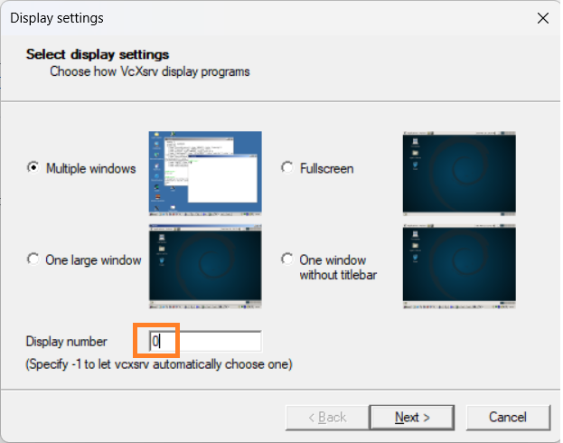
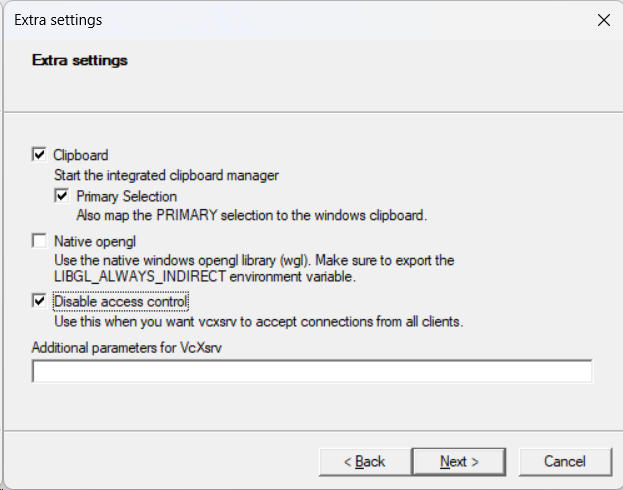

# Read Me

**Windows 11 + WSL 2 made ROS development easy on Windows Platform, this is a an attempt to install ROS 2 (Iron), Rviz, Gazebo on Windows using WSL2**

## 1. Install WSL2
Follow instructions in this [official link](https://learn.microsoft.com/en-us/windows/wsl/install).
## 2. Install XLaunch
Download XLaunch using [this link](https://excellmedia.dl.sourceforge.net/project/vcxsrv/vcxsrv/1.20.14.0/vcxsrv-64.1.20.14.0.installer.exe).

Set it up like this
- Select any window configuration
- Set display number to 0
- 
- Uncheck Native opnegl
- Check Disable access control
- 

## 3. Install Ubuntu 22.04 LTS
Available on  Microsoft Store 
Set up a username and password.

### 2.1 Set the following environment variables:

```bash
export GAZEBO_IP=127.0.0.1
```
```bash
export DISPLAY=$(cat /etc/resolv.conf | grep nameserver | awk '{print $2}'):0
```
```bash 
export LIBGL_ALWAYS_INDIRECT=0
```

### 2.2 ROS Installation
Go to [ROS Installation Documentation](http://docs.ros.org/en/iron/Installation/Ubuntu-Install-Debians.html) for detailed instructions 
or follow the steps below directly.

#### 2.2.1 Enable required repositories
```bash
sudo apt install software-properties-common
```
```bash
sudo add-apt-repository universe
```
```bash
sudo apt update && sudo apt install curl -y
```
```bash
sudo curl -sSL https://raw.githubusercontent.com/ros/rosdistro/master/ros.key -o /usr/share/keyrings/ros-archive-keyring.gpg
```
```bash
echo "deb [arch=$(dpkg --print-architecture) signed-by=/usr/share/keyrings/ros-archive-keyring.gpg] http://packages.ros.org/ros2/ubuntu $(. /etc/os-release && echo $UBUNTU_CODENAME) main" | sudo tee /etc/apt/sources.list.d/ros2.list > /dev/null
```

#### 2.2.2 Install development tools

```
sudo apt update && sudo apt install ros-dev-tools
```

#### 2.2.3 Install ROS2

```bash 
sudo apt update
``` 
```bash
sudo apt upgrade
```
```bash
sudo apt install ros-iron-desktop
```
```bash 
sudo apt install ros-iron-ros-base
```

#### 2.2.4 Set up the environment:

```bash
source /opt/ros/iron/setup.bash
```

### 2.3 Install Gazebo

Just following single command works

```bash
curl -sSL http://get.gazebosim.org | sh
```

For more details [official Gazebo tutorial](https://classic.gazebosim.org/tutorials?tut=install_ubuntu)

#### 2.3.1 Run Gazebo

```bash
gazebo
```

## 3. Additional Steps or Notes
